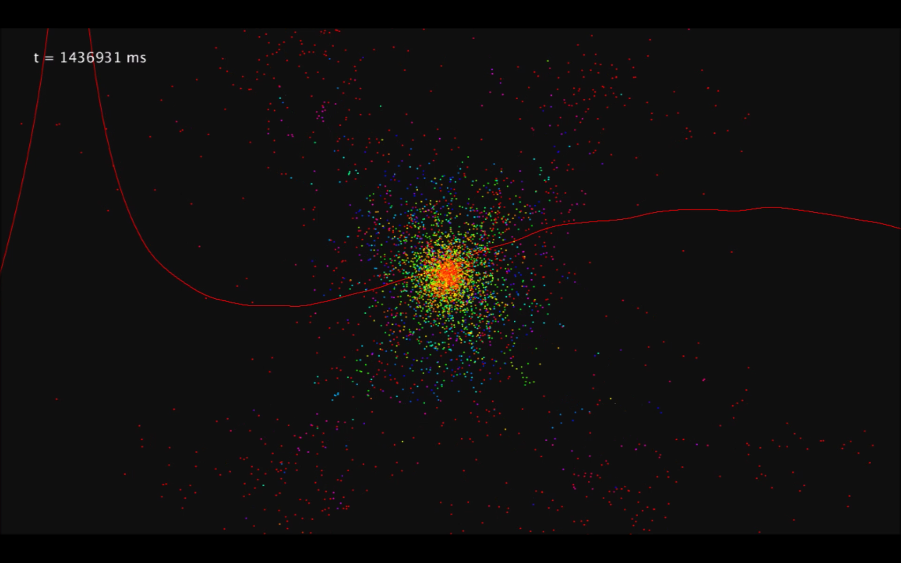
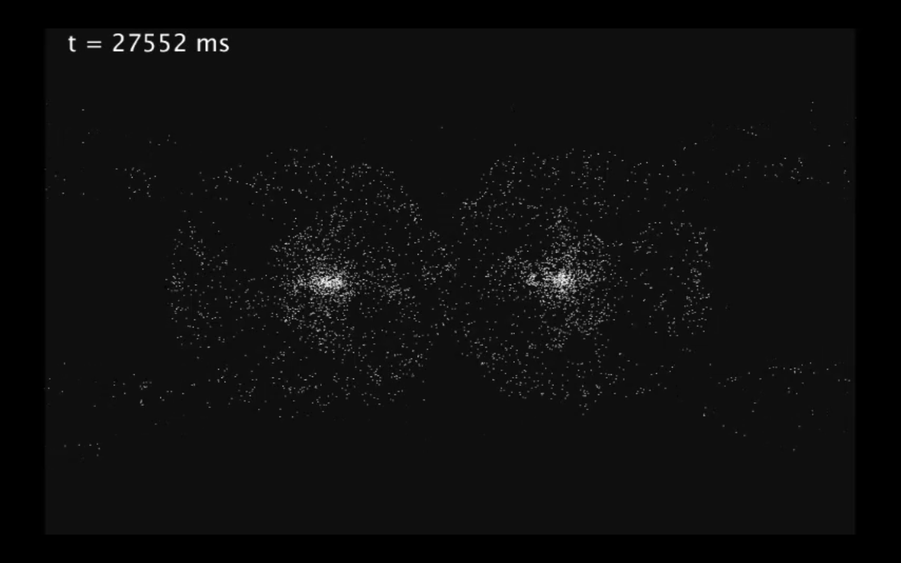

# gravity-particle_sim
Gravitational simulation of particles using newtonian gravitation and the euler method.
The color indicates the z-axis while the red line is a plot of the system's total kinetic energy (KE against time).

